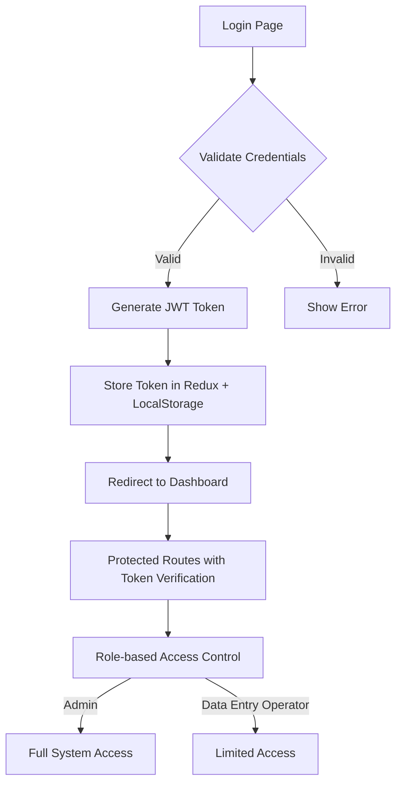
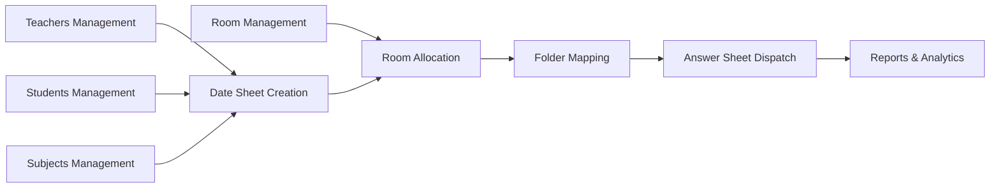

# 🏗️ Examination Management System - Architectural Plan

## 📋 Project Overview

**Full-Stack MERN Application** with MongoDB Atlas, Express.js, React (Vite + TypeScript), and Node.js in a monorepo structure supporting comprehensive examination management workflows.

## 🗂️ Project Structure

```
SEMS/
├── client/                          # React Frontend (Vite + TypeScript)
│   ├── public/
│   │   ├── index.html
│   │   └── favicon.ico
│   ├── src/
│   │   ├── components/              # Reusable UI Components
│   │   │   ├── common/
│   │   │   │   ├── Button.tsx
│   │   │   │   ├── FormInput.tsx
│   │   │   │   ├── Loader.tsx
│   │   │   │   ├── Modal.tsx
│   │   │   │   ├── Table.tsx
│   │   │   │   └── ThemeToggle.tsx
│   │   │   ├── layout/
│   │   │   │   ├── Header.tsx
│   │   │   │   ├── Sidebar.tsx
│   │   │   │   └── Layout.tsx
│   │   │   └── features/            # Feature-specific components
│   │   │       ├── auth/
│   │   │       ├── dashboard/
│   │   │       ├── teachers/
│   │   │       ├── students/
│   │   │       ├── subjects/
│   │   │       ├── datesheets/
│   │   │       ├── rooms/
│   │   │       └── dispatch/
│   │   ├── pages/                   # Page Components
│   │   │   ├── Dashboard.tsx
│   │   │   ├── Login.tsx
│   │   │   ├── Teachers.tsx
│   │   │   ├── Students.tsx
│   │   │   ├── Subjects.tsx
│   │   │   ├── DateSheets.tsx
│   │   │   ├── RoomAllocation.tsx
│   │   │   └── AnswerSheetDispatch.tsx
│   │   ├── redux/                   # State Management
│   │   │   ├── store.ts
│   │   │   ├── rootReducer.ts
│   │   │   └── slices/
│   │   │       ├── authSlice.ts
│   │   │       ├── teacherSlice.ts
│   │   │       ├── studentSlice.ts
│   │   │       ├── subjectSlice.ts
│   │   │       ├── datesheetSlice.ts
│   │   │       ├── roomSlice.ts
│   │   │       └── dispatchSlice.ts
│   │   ├── hooks/                   # Custom Hooks
│   │   │   ├── useFetch.ts
│   │   │   ├── useToast.ts
│   │   │   └── useAuth.ts
│   │   ├── services/                # API Services
│   │   │   ├── api.ts
│   │   │   ├── authService.ts
│   │   │   ├── teacherService.ts
│   │   │   ├── studentService.ts
│   │   │   └── [...other services]
│   │   ├── utils/                   # Utility Functions
│   │   │   ├── constants.ts
│   │   │   ├── helpers.ts
│   │   │   └── validation.ts
│   │   ├── types/                   # TypeScript Definitions
│   │   │   ├── auth.ts
│   │   │   ├── teacher.ts
│   │   │   ├── student.ts
│   │   │   └── [...other types]
│   │   ├── styles/                  # Global Styles
│   │   │   └── globals.css
│   │   ├── routes/                  # Route Configuration
│   │   │   ├── ProtectedRoute.tsx
│   │   │   └── AppRoutes.tsx
│   │   ├── App.tsx
│   │   ├── main.tsx
│   │   └── vite-env.d.ts
│   ├── package.json
│   ├── tsconfig.json
│   ├── tailwind.config.js
│   ├── vite.config.ts
│   └── .eslintrc.js
├── server/                          # Node.js Backend (Express)
│   ├── src/
│   │   ├── controllers/             # Route Controllers
│   │   │   ├── authController.js
│   │   │   ├── teacherController.js
│   │   │   ├── studentController.js
│   │   │   ├── subjectController.js
│   │   │   ├── datesheetController.js
│   │   │   ├── roomController.js
│   │   │   └── dispatchController.js
│   │   ├── models/                  # Mongoose Models
│   │   │   ├── User.js
│   │   │   ├── Teacher.js
│   │   │   ├── Student.js
│   │   │   ├── Subject.js
│   │   │   ├── DateSheet.js
│   │   │   ├── Room.js
│   │   │   ├── FolderMapping.js
│   │   │   └── AnswerSheetDispatch.js
│   │   ├── routes/                  # API Routes
│   │   │   ├── authRoutes.js
│   │   │   ├── teacherRoutes.js
│   │   │   ├── studentRoutes.js
│   │   │   ├── subjectRoutes.js
│   │   │   ├── datesheetRoutes.js
│   │   │   ├── roomRoutes.js
│   │   │   └── dispatchRoutes.js
│   │   ├── middleware/              # Custom Middleware
│   │   │   ├── auth.js
│   │   │   ├── errorHandler.js
│   │   │   ├── asyncHandler.js
│   │   │   ├── validation.js
│   │   │   └── upload.js
│   │   ├── utils/                   # Backend Utilities
│   │   │   ├── database.js
│   │   │   ├── jwt.js
│   │   │   ├── constants.js
│   │   │   └── helpers.js
│   │   ├── validations/             # Joi Validation Schemas
│   │   │   ├── authValidation.js
│   │   │   ├── teacherValidation.js
│   │   │   ├── studentValidation.js
│   │   │   └── [...other validations]
│   │   ├── seeders/                 # Database Seeders
│   │   │   ├── userSeeder.js
│   │   │   ├── teacherSeeder.js
│   │   │   ├── studentSeeder.js
│   │   │   ├── subjectSeeder.js
│   │   │   └── index.js
│   │   ├── config/                  # Configuration Files
│   │   │   ├── database.js
│   │   │   └── multer.js
│   │   ├── app.js
│   │   └── server.js
│   ├── package.json
│   ├── .env.example
│   └── .eslintrc.js
├── package.json                     # Root package.json with concurrently
├── .gitignore
├── README.md
└── .env.example
```

## 🎯 Core Features Architecture

### 🔐 Authentication System


### 📊 Data Management Flow


### 🏗️ Redux State Architecture
```mermaid
graph TB
    A[Redux Store] --> B[Auth Slice]
    A --> C[Teacher Slice]
    A --> D[Student Slice]
    A --> E[Subject Slice]
    A --> F[DateSheet Slice]
    A --> G[Room Slice]
    A --> H[Dispatch Slice]
    
    B --> B1[user, token, isAuthenticated, loading]
    C --> C1[teachers[], loading, error]
    D --> D1[students[], loading, error]
    E --> E1[subjects[], loading, error]
    F --> F1[datesheets[], loading, error]
    G --> G1[rooms[], allocations[], loading, error]
    H --> H1[dispatches[], folders[], loading, error]
```

## 🛠️ Technology Stack Implementation

### Frontend (React + Vite + TypeScript)
- **Framework**: React 18 with Vite for fast development
- **Styling**: Tailwind CSS with dark mode support
- **State Management**: Redux Toolkit with persistence
- **HTTP Client**: Axios with interceptors for token management
- **Notifications**: React Hot Toast for user feedback
- **Forms**: React Hook Form with validation
- **File Handling**: PDF preview and file upload capabilities
- **Routing**: React Router with protected routes

### Backend (Node.js + Express)
- **Framework**: Express.js with async/await patterns
- **Database**: MongoDB Atlas with Mongoose ODM
- **Authentication**: JWT with refresh token strategy
- **Validation**: Joi for request validation
- **File Upload**: Multer for PDF and document handling
- **Security**: Helmet, CORS, rate limiting
- **Error Handling**: Centralized error middleware

## 🗃️ Database Schema Design

### Core Models
1. **User Model** (Authentication)
   - email, password, role (admin/operator), isActive, createdAt

2. **Teacher Model**
   - name, email, phone, subjects[], department, experience, isActive

3. **Student Model**
   - rollNumber, name, class (10th/12th), section, subjects[], isActive

4. **Subject Model**
   - name, code, class, duration, maxMarks, isActive

5. **DateSheet Model**
   - examName, class, subjects[], examDates[], isPublished

6. **Room Model**
   - roomNumber, capacity, location, facilities[], isActive

7. **RoomAllocation Model**
   - dateSheet, room, subject, examDate, supervisors[], students[]

8. **AnswerSheetDispatch Model**
   - dateSheet, subject, totalSheets, dispatchedSheets, status

## 🔧 Key Implementation Features

### 1. Redux Toolkit Slices
- **Async Thunks** for API calls with loading states
- **Error handling** with toast notifications
- **Optimistic updates** for better UX
- **Data normalization** for efficient state management

### 2. Reusable Components
- **Form Components**: Input, Select, Checkbox with validation
- **Data Display**: Table with sorting, filtering, pagination
- **Feedback**: Loading spinners, modals, toast notifications
- **Layout**: Responsive sidebar, header with user menu

### 3. API Architecture
- **RESTful endpoints** with consistent response format
- **Middleware chain**: Authentication → Validation → Controller
- **Error handling** with proper HTTP status codes
- **File upload** endpoints for PDF processing

### 4. Development Features
- **Hot reload** with Vite for frontend development
- **Nodemon** for backend auto-restart
- **ESLint + Prettier** for code quality
- **Concurrently** to run both servers with single command

## 📱 User Interface Layouts

### 1. Dashboard
- **Summary Cards**: Total teachers, students, active exams
- **Quick Actions**: Create date sheet, allocate rooms
- **Recent Activity**: Latest operations and updates
- **Charts**: Examination statistics and trends

### 2. Data Management Pages
- **CRUD Operations**: Create, Read, Update, Delete for all entities
- **Bulk Import**: CSV/Excel upload for teachers and students
- **Search & Filter**: Advanced filtering with multiple criteria
- **Export Features**: PDF reports and data exports

### 3. Examination Management
- **Date Sheet Builder**: Drag-and-drop interface for scheduling
- **Room Allocation**: Visual room layout with capacity management
- **Dispatch Tracking**: Real-time status of answer sheet processing
- **CBSE Format**: Generate official examination documents

## 🚀 Development Workflow

### Setup Commands
```bash
# Install dependencies for both client and server
npm install

# Start development servers (runs both frontend and backend)
npm run dev

# Seed comprehensive sample data
npm run seed

# Run tests
npm run test

# Build for production
npm run build
```

### Environment Configuration
- **Development**: Local development with hot reload
- **Production**: Optimized builds with proper error handling
- **Database**: MongoDB Atlas connection with proper indexing
- **Authentication**: JWT with secure secret management

## 📦 Package Dependencies

### Frontend Key Packages
- `react`, `react-dom`, `react-router-dom`
- `@reduxjs/toolkit`, `react-redux`
- `axios`, `react-hot-toast`
- `tailwindcss`, `@headlessui/react`
- `react-hook-form`, `@hookform/resolvers`
- `typescript`, `@types/react`

### Backend Key Packages
- `express`, `mongoose`, `bcryptjs`
- `jsonwebtoken`, `joi`, `multer`
- `helmet`, `cors`, `express-rate-limit`
- `dotenv`, `nodemon`, `concurrently`

This architecture provides a robust, scalable foundation for your Examination Management System with comprehensive features, proper separation of concerns, and modern development practices.

## 🔄 Implementation Phase

The next step involves switching to **Code Mode** to implement this architecture by:

1. Setting up the monorepo structure with root package.json
2. Creating the React frontend with Vite and TypeScript
3. Setting up the Express.js backend with MongoDB integration
4. Implementing authentication and state management
5. Creating all the specified components and features
6. Adding comprehensive seed data for testing
7. Configuring development and build scripts

Ready to proceed with implementation!